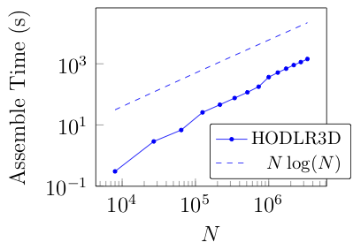
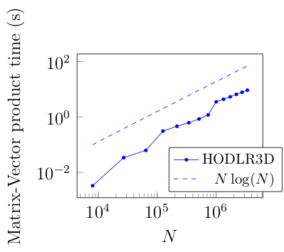
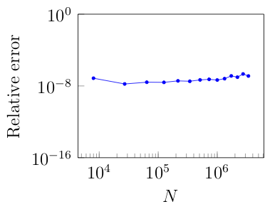

Benchmarks
^^^^^^^^^^

The run-time inputs are set as follows

1. cubeRootN	is varied to record the assemble/initialization time, matrix-vector product time and the realtive forward error in the solution.
2. nParticlesInLeafAlong1D	is set to 6
3. L	is set to 1
4. TOL_POW is set to 7
5. Qchoice is set to 7

All the following benchmarks have been recorded by running the code on an Intel Xeon Gold 2.5GHz processor with 8 OpenMP threads. The compiler flags that were utilized are the same are those mentioned in the CMakeLists.txt file.

